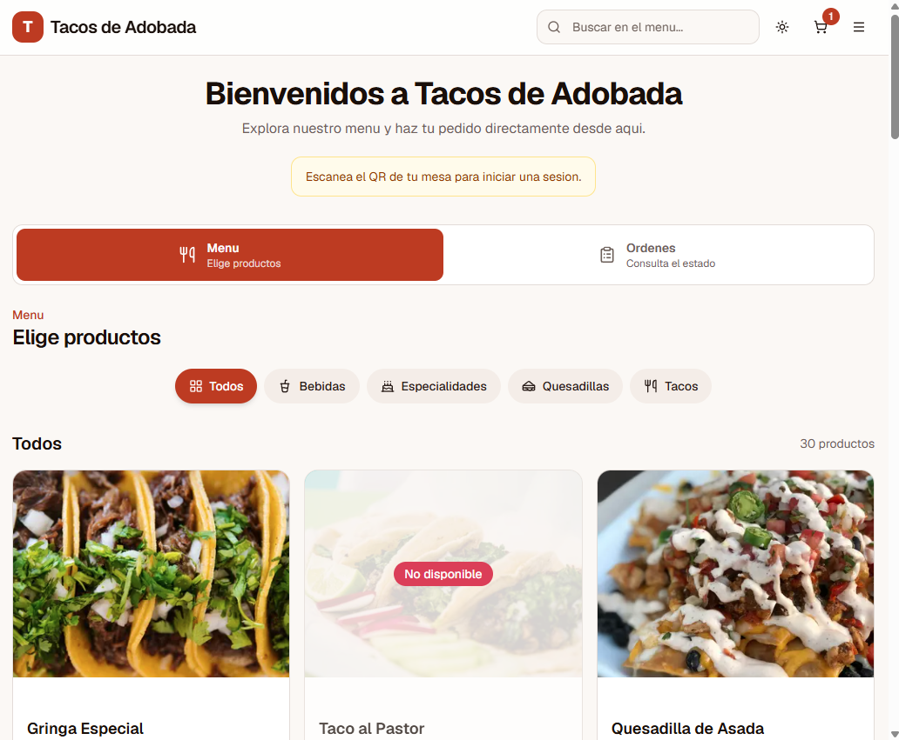
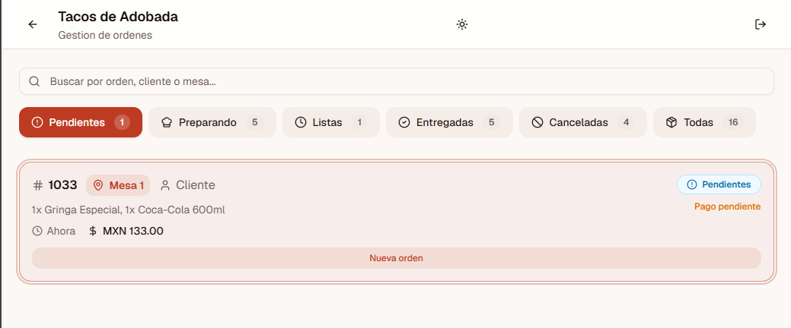
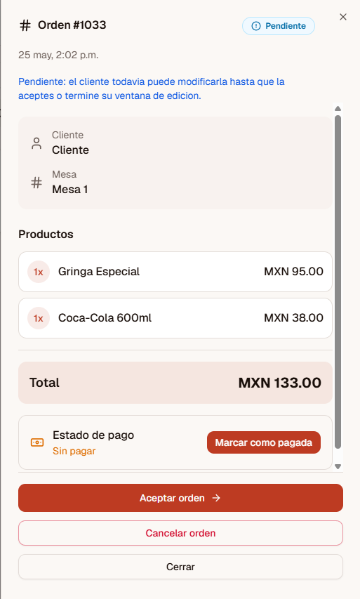
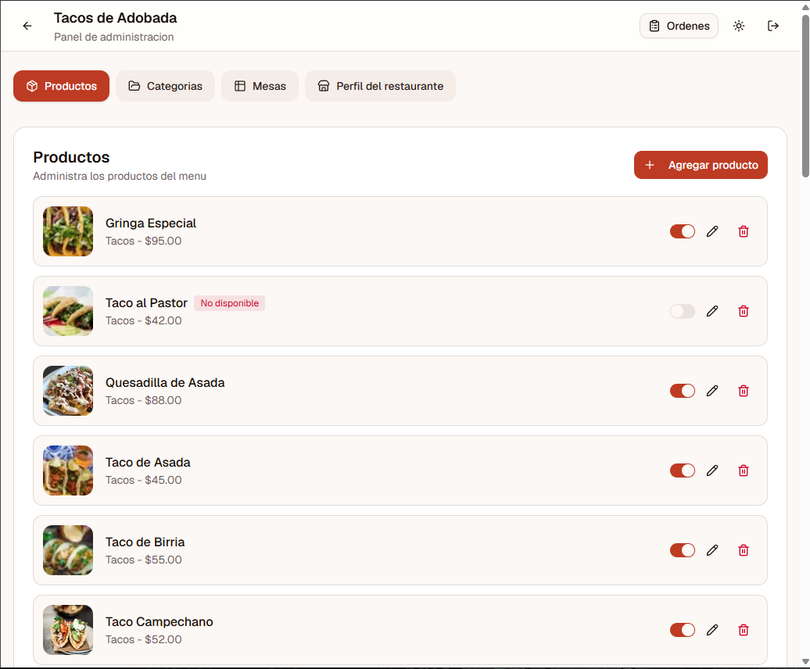

# Restaurant Menu App

Sistema web para restaurantes/cafeterías pequeñas que permite visualizar un menú digital y gestionar órdenes desde un panel administrativo.

## Features

- Menú digital
- Carrito de compras
- Gestión de órdenes
- Estados de pedido
- Dashboard administrativo
- CRUD de productos y categorías
- Backend con Supabase
- Deploy con Vercel

## Tech Stack

- Next.js
- TypeScript
- Supabase
- TailwindCSS
- Vercel

## Screenshots

<<<<<<< HEAD
### Customer Menu


### Orders Dashboard


### Order Details


### Admin Panel

=======
### Menu

>>>>>>> 685c347e510b0f5894d005e33079269b7cad149b

### Cart


### Orders Dashboard


### Admin Panel

## Local Setup

```bash
pnpm install
pnpm dev
```

## Project Status

Proyecto MVP/personal enfocado en aprendizaje de arquitectura full-stack y flujos de órdenes en tiempo real.

## Author

Desarrollado por Makendo Shirakawa.
